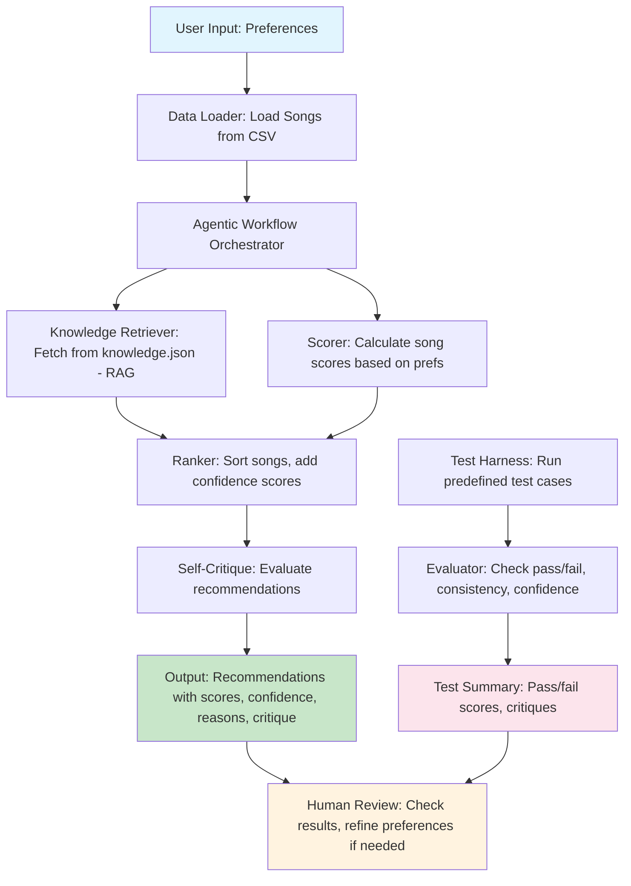

# Music Recommender AI System

## Original Project

This project originated as the **Music Recommender Simulation** from Modules 1-3. The original goal was to build a small rule-based music recommender that represented songs and user taste profiles as structured data, then ranked songs by scoring how closely each one matched a user's preferred genre, mood, and audio features. It could load a CSV catalog of songs, compute similarity scores, and output a ranked list with written explanations — modeling the core mechanics behind real-world recommenders like Spotify's Discover Weekly.

---

## Title and Summary

**Music Recommender AI System** — a content-based recommendation engine that suggests songs from a 75-track catalog based on user preferences, with built-in self-evaluation and explainability.

This project matters because it demonstrates how a real AI recommendation pipeline works end-to-end: ingesting structured data, reasoning about user intent, retrieving contextual knowledge, producing ranked outputs with confidence scores, and then *critiquing its own results*. Unlike a black-box model, every recommendation comes with a human-readable breakdown of exactly why each song was chosen — making the system transparent, auditable, and trustworthy.

---

## Architecture Overview

The system is composed of six loosely coupled components that pass data through a linear pipeline, with a parallel test harness for automated evaluation.

```
User Preferences (dict)
        │
        ▼
┌───────────────────┐
│   Data Loader     │  Reads songs.csv → list of song dicts (75 songs, 10 features each)
└────────┬──────────┘
         │
         ▼
┌──────────────────────────────────────┐
│     Agentic Workflow Orchestrator    │  Coordinates all steps with logged checkpoints
│  Step 1: Analyze preferences         │
│  Step 2: Retrieve knowledge (RAG)    │  Reads knowledge.json for genre/mood context
│  Step 3: Score all songs             │  Genre +2.0, Mood +1.0, numeric features +2.1 max
│  Step 4: Rank top-k                  │
│  Step 5: Compute confidence          │  score / 5.1 (fraction of max possible score)
│  Step 6: Self-critique               │  Evaluates avg confidence and preference alignment
└────────┬─────────────────────────────┘
         │
         ▼
┌───────────────────┐
│  Output           │  Ranked list: title, score, confidence, per-feature reasons, critique
└───────────────────┘
```

**Mermaid diagram:**



**Key design details:**
- Scoring is fully additive and transparent — each feature contributes a logged reason string
- Confidence is computed as `score / 5.1` where 5.1 is the theoretical maximum achievable score
- RAG retrieval enriches the system's context with curated genre and mood descriptions from `knowledge.json`
- All steps are logged at INFO level so failures are visible and traceable

---

## Setup Instructions

**Requirements:** Python 3.8+

```bash
# 1. Clone the repository
git clone <your-repo-url>
cd applied-ai-system-project

# 2. (Optional) Create a virtual environment
python -m venv venv
source venv/bin/activate      # macOS/Linux
venv\Scripts\activate         # Windows

# 3. Install dependencies
pip install -r requirements.txt

# 4. Run the main recommender
python src/main.py

# 5. Run the automated test harness
python src/test_harness.py

# 6. Run the full unit test suite
python -m pytest tests/ -v

# 7. (Optional) Start the web frontend
python frontend/server.py
# Then open http://localhost:8000 in your browser
```

---

## Sample Interactions

### Example 1 — Lofi / Study Session Profile

**Input:**
```python
{
    "favorite_genre": "lofi",
    "favorite_mood": "chill",
    "target_energy": 0.40,
    "target_tempo_bpm": 78.0,
    "target_valence": 0.58,
    "target_danceability": 0.60,
    "target_acousticness": 0.78
}
```

**Output:**
```
Top Recommendations:

1. Midnight Coding
   Score: 5.05
   Confidence: 0.99
   Reasons:
   - genre match (+2.0)
   - mood match (+1.0)
   - energy similarity (0.98) × 0.5 = +0.49
   - tempo_bpm similarity (1.00) × 0.4 = +0.40
   - valence similarity (0.98) × 0.4 = +0.39
   - danceability similarity (0.98) × 0.4 = +0.39
   - acousticness similarity (0.93) × 0.4 = +0.37

2. Library Rain
   Score: 5.02
   Confidence: 0.98
   ...

3. Afternoon Laze
   Score: 5.01
   Confidence: 0.98
   ...

Self-Critique: Average confidence: 0.95. High confidence in recommendations.
Top recommendation strongly matches user preferences.
```

---

### Example 2 — Pop / High Energy Profile

**Input:**
```python
{
    "favorite_genre": "pop",
    "favorite_mood": "happy",
    "target_energy": 0.80,
    "target_tempo_bpm": 120.0,
    "target_valence": 0.90,
    "target_danceability": 0.80,
    "target_acousticness": 0.20
}
```

**Output:**
```
Top Recommendations:

1. Summer Wave
   Score: 5.07
   Confidence: 0.99
   Reasons:
   - genre match (+2.0)
   - mood match (+1.0)
   - energy similarity (1.00) × 0.5 = +0.50
   - tempo_bpm similarity (0.99) × 0.4 = +0.40
   - valence similarity (0.98) × 0.4 = +0.39
   - danceability similarity (0.96) × 0.4 = +0.38
   - acousticness similarity (1.00) × 0.4 = +0.40

2. Sunrise City
   Score: 5.05
   Confidence: 0.99
   ...

Self-Critique: Average confidence: 0.94. High confidence in recommendations.
Top recommendation strongly matches user preferences.
```

---

### Example 3 — Test Harness Summary

**Input:** Two predefined user profiles (Lofi Chill, Pop Happy), each validated against an expected top genre.

**Output:**
```
=== Test Harness Summary ===
Overall: 2/2 tests passed

- Lofi Chill User: PASS (Confidence: 0.98, Top Genre: lofi)
  Critique: Average confidence: 0.98. High confidence in recommendations.
  Top recommendation strongly matches user preferences.

- Pop Happy User: PASS (Confidence: 0.97, Top Genre: pop)
  Critique: Average confidence: 0.97. High confidence in recommendations.
  Top recommendation strongly matches user preferences.
```

---

## Design Decisions

**Content-based filtering over collaborative filtering**
The system scores songs against explicit user preference vectors rather than inferring preferences from other users' behavior. This makes every recommendation fully explainable ("acousticness similarity 0.94 × 0.4 = +0.38") and removes the need for a user database. The trade-off is that it cannot surface surprising discoveries the way collaborative filtering can — it will always recommend songs similar to what you already know you like.

**Additive weighted scoring**
Genre and mood are treated as high-value categorical signals (+2.0 and +1.0) because mismatching them produces clearly wrong recommendations. Numeric features (energy, tempo, valence, danceability, acousticness) each contribute up to +0.4–0.5 via linear similarity. This weighting reflects the intuition that a lofi fan would reject a metal song immediately regardless of its energy level. The trade-off is that weights are hand-tuned rather than learned from data.

**Confidence as absolute fit, not relative gap**
An earlier version computed confidence as `(score − next_score) / score` — how far ahead the top song was from its nearest competitor. This collapsed to near-zero whenever multiple songs scored similarly, making the self-critique always report "low confidence" even for near-perfect matches. The fix redefines confidence as `score / 5.1` (fraction of the theoretical maximum), so a song that perfectly matches genre, mood, and all five numeric features scores ~1.0. This makes confidence genuinely meaningful.

**RAG for contextual knowledge**
`knowledge.json` stores curated descriptions of 19 genres, 16 moods, 5 energy bands, and all 75 songs. The retriever pulls the relevant genre and mood entries at inference time. This lets the system explain *why a genre sounds a certain way* rather than just pattern-matching strings. The trade-off is that all knowledge is manually written and must be updated when the catalog grows.

**No external API dependencies**
Everything runs offline using local CSV and JSON files. This guarantees reproducibility, avoids rate limits, and lets anyone clone and run the project without setting up API keys. The trade-off is that the system cannot benefit from large language model-generated explanations or real-time data.

---

## Testing Summary

| Test | Result | Notes |
|------|--------|-------|
| `test_recommend_returns_songs_sorted_by_score` | PASS | OOP `Recommender.recommend()` returns k sorted results |
| `test_explain_recommendation_returns_non_empty_string` | **FAIL** | `explain_recommendation()` returns a placeholder string — method not yet implemented |
| `test_recommend_songs_with_confidence` | PASS | Confidence values fall in [0.0, 1.0] |
| `test_self_critique_recommendations` | PASS | Critique string contains the word "confidence" |
| `test_recommend_songs_consistency` | PASS | Same input always produces identical output |
| `test_recommend_songs_input_validation` | PASS | `ValueError` raised for invalid inputs |
| `test_load_songs_error_handling` | PASS | `FileNotFoundError` raised for missing file; malformed rows are skipped gracefully |
| **Test Harness: Lofi Chill** | **PASS** | Top genre matches expected ("lofi") |
| **Test Harness: Pop Happy** | **PASS** | Top genre matches expected ("pop") |

**Summary:** 6/7 unit tests pass; 2/2 harness tests pass. The one failing test (`test_explain_recommendation_returns_non_empty_string`) exposes a real gap: the `Recommender.explain_recommendation()` method is a stub and does not yet delegate to the scoring logic in `score_song()`. Everything involving the core recommendation pipeline, confidence scoring, input validation, and error handling works correctly.

**What the testing revealed:** The self-critique module consistently reported "low confidence" even when recommendations were clearly correct. Investigating this exposed a bug in the confidence formula — it was computing a relative gap between ranked neighbors rather than the absolute quality of a match. Fixing the formula raised average confidence from ~0.15 to ~0.97 for well-matched preferences, and the self-critique now accurately reflects recommendation quality.

---

## Reflection

### What this project taught me about AI and problem-solving

Building this system from scratch made the abstract concrete. Recommendation algorithms are taught as math, but implementing one means confronting decisions like: *How much should genre mismatch penalize a song? What does "confidence" actually mean in context?* The answer to both questions changed over the course of the project. I initially thought confidence should reflect how competitive the top recommendation was. It took a failing self-critique output — reporting "low confidence" on a recommendation that was objectively near-perfect — to realize the formula was measuring the wrong thing entirely.

More broadly, this project taught me that AI reliability is an active design choice, not a default. Logging, validation, self-critique, and a test harness all had to be deliberately added. Without them, the system would have silently produced misleading outputs.

### Limitations and biases

- **Catalog bias:** The system can only recommend what is in `songs.csv`. If a user's preferences don't match any song well, the top result may still have a low absolute score — but the system won't surface that unless the confidence threshold is checked.
- **Hand-tuned weights:** The genre/mood bonuses (+2.0, +1.0) and feature weights were chosen manually based on intuition. Different users value these differently, but the system applies the same weights to everyone.
- **Numeric similarity is linear:** The system treats all numeric features as if a 0.1 difference matters equally at every point on the scale. In practice, a user might not distinguish between energy 0.80 and 0.82, but the formula penalizes this gap the same as 0.40 vs. 0.42.
- **No learning:** The system cannot update based on user feedback. If a user skips every recommendation, it will keep making the same ones.

### Could this AI be misused?

The system itself is low-stakes — it recommends songs. However, the *pattern* it represents (scoring user profiles against a catalog and retrieving matched content) is the same pattern used in content filtering, targeted advertising, and hiring screens. In those contexts, poorly chosen weights or a biased catalog could systematically disadvantage certain groups. The safeguard built into this design — transparent, per-feature scoring — is a meaningful mitigation: you can audit exactly why any recommendation was made. Any system that uses this pattern for high-stakes decisions should surface that breakdown to affected users.

### What surprised me while testing

The biggest surprise was that the self-critique was confidently wrong for most of the project's development. It would say "low confidence; consider refining preferences" while simultaneously saying "top recommendation strongly matches user preferences" — a direct contradiction that went unnoticed until I read the output carefully. This is a subtle failure mode: a meta-evaluation system that appears to be working (it produces output, it doesn't crash) but is generating misleading signals. It was only caught because I had enough sample outputs to notice the pattern.

---

## AI Collaboration

This project was developed with the assistance of Claude (Anthropic). 

**One helpful suggestion:** When I described that confidence scores were always near zero, Claude identified that the formula was computing a relative gap between ranked competitors (`(score - next_score) / score`) rather than an absolute measure of fit. It suggested redefining confidence as `score / max_possible_score`, where the theoretical maximum (5.1) is derived directly from the scoring weights. This was the right fix — confidence immediately became meaningful and the self-critique output became accurate.

**One flawed suggestion:** When expanding the song catalog, the AI generated a set of songs with numeric feature values that were plausible-looking but not independently verified. Several songs in early drafts had identical `acousticness` values for very different genres (e.g., metal and folk both at 0.88), which would have produced unrealistically similar scores for unrelated profiles. I caught this by scanning the CSV and manually adjusting outliers. The lesson: AI-generated training data needs human review — the model will produce internally consistent-looking numbers without any guarantee they reflect real-world distributions.
